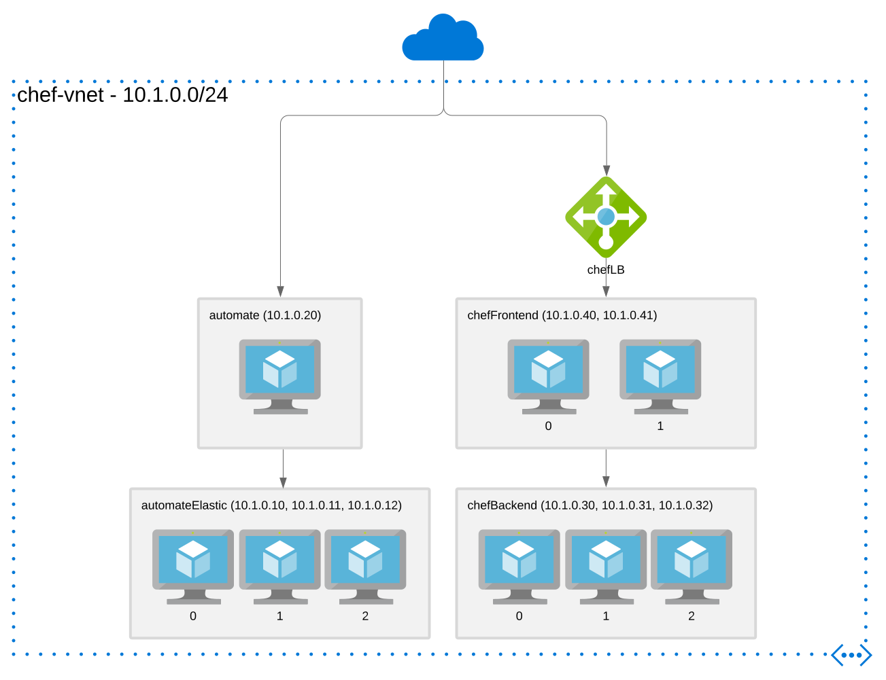

# Chef ARM Templates

Templates to create:
* virtual network
* storage account with blob container for initial sharing of secrets between servers
* 3 node ElasticSearch cluster for Chef Automate
* Chef Automate server
* 3 node Chef Backend HA cluster
* 2 Chef Infra Server frontends
* load balancer for Chef Infra Server frontends
* Linux and Windows Virtual Machines with the Azure Chef Extension
* Azure deployIfNotExists policies - to automatically add the Azure Chef Extension to Linux & Windows Virtual Machines without the extension
* Virtual Machine Scale Sets with the Azure Chef Extension



## Before using

* Familarise with Open Distro for Elasticsearch configuration, particularly security administration (https://opendistro.github.io/for-elasticsearch-docs/docs/security-configuration/)
* Consider removing the public IP addressing
* Consider restricting the network security groups

## Usage

```
az deployment group create --name vnet --resource-group RGNAMEHERE --template-file vnet/template.json --parameters @vnet/parameters.json
az deployment group create --name storageAccount --resource-group RGNAMEHERE --template-file storageAccount/template.json --parameters @storageAccount/parameters.json
az deployment group create --name automateElastic --resource-group RGNAMEHERE --template-file automateElastic/template.json --parameters @automateElastic/parameters.json --parameters adminPublicKey="$(cat ~/.ssh/KEYNAMEHERE.pub)"
az deployment group create --name automate --resource-group RGNAMEHERE --template-file automate/template.json --parameters @automate/parameters.json --parameters adminPublicKey="$(cat ~/.ssh/KEYNAMEHERE.pub)"
az deployment group create --name chefLB --resource-group RGNAMEHERE --template-file chefLB/template.json --parameters=@chefLB/parameters.json
az deployment group create --name chefBackend --resource-group RGNAMEHERE --template-file chefBackend/template.json --parameters @chefBackend/parameters.json --parameters adminPublicKey="$(cat ~/.ssh/KEYNAMEHERE.pub)"
az deployment group create --name chefFrontend --resource-group RGNAMEHERE --template-file chefFrontend/template.json --parameters @chefFrontend/parameters.json --parameters adminPublicKey="$(cat ~/.ssh/KEYNAMEHERE.pub)"
```

### Airgap
By default the templates and configuration scripts assume internet access.

A `makeairgap.sh` script is provided to download on an internet facing Linux system all of the required artifacts to the `.airgaptmp` directory, which can then be staged on the `_artifactsLocation` blob container. It takes two arguments, the artifact location and artifact token which can be retrived from the outputs of the storageAccount template. e.g. `./makeairgap.sh "LOCATION" "TOKEN". At this time, this downloads the artifacts but only uploads the scripts. Large artifacts such as the RPMs and the airgap bundle for Automate must be uploaded to the artifacts blob container by other means e.g. https://github.com/Azure/blobxfer, Azure Storage Explorer app or other method.

The custom script extension `script.sh` for the Elasticsearch cluster, Automate, Chef Backend cluster and Chef Frontends take an airgap argument which will retrive the required artifacts from the specified `_artifactsLocation` blob container. To enable this behaviour, there is an `enableAirgap` parameter in the matching ARM templates.

### Network

```
VNET: 10.1.0.0/24
automateElastic: 10.1.0.10, 10.1.0.11, 10.1.0.12
automate: 10.1.0.20
chefBackend: 10.1.0.30, 10.1.0.31, 10.1.0.32
chefFrontEnd: 10.1.0.40, 10.1.0.41
```

### Manual steps

After deploying the templates, some manual steps are required.
* Retrieve credentials for Automate from the blob container and login
* Create users and orgs on a Chef Server Frontend e.g.
```
chef-server-ctl org-create test TestOrg -f test-validator.pem
chef-server-ctl user-create admin Admin User admin@example.com TestPassword -o test -f admin.pem
chef-server-ctl grant-server-admin-permissions admin
```

### Chef Client nodes

Examples of using the Azure Chef extension is provided in the `template_with_extension.json` template file in `chefLinuxVM` and `chefWindowsVM`:

```
az deployment group create --name chefLinuxVM --resource-group RGNAMEHERE --template-file chefLinuxVM/template_with_extension.json --parameters @chefLinuxVM/parameters.json --parameters adminPublicKey="$(cat ~/.ssh/KEYNAMEHERE.pub)"
az deployment group create --name chefWindowsVM --resource-group RGNAMEHERE --template-file chefWindowsVM/template_with_extension.json --parameters @chefWindowsVM/parameters.json
```

[Azure Chef Extension](https://github.com/chef-partners/azure-chef-extension)

[Azure Quickstart Templates - Provision a Ubuntu/Centos VM and bootstrapping the Chef Agent](https://github.com/Azure/azure-quickstart-templates/tree/master/chef-json-parameters-linux-vm)

The `template.json` files are intended for use with Azure Policy - deployIfNotExists below.

### Virtual Machine Scale Sets

An example of using the Azure Chef extension is provided in `chefScaleSet:

```
az deployment group create --name chefLinuxScaleSet --resource-group RGNAMEHERE --template-file chefScaleSet/template.json --parameters @chefScaleSet/parameters.json --parameters adminPublicKey="$(cat ~/.ssh/azure-greynolds.pub)"
```

### Azure Policy - deployIfNotExists

An alternative to adding the Azure Chef extension via ARM templates is to define Azure Policy to add the extension using deployIfNotExists. Example policies are provided in `azurePolicy`.

```
az policy definition create --name DINE-LinuxChef --rules "$(jq .policyRule azurePolicy/DINE-LinuxChef.json)" --params "$(jq .parameters azurePolicy/DINE-LinuxChef.json)"

az policy definition create --name DINE-WindowsChef --rules "$(jq .policyRule azurePolicy/DINE-WindowsChef.json)" --params "$(jq .parameters azurePolicy/DINE-WindowsChef.json)"

az policy assignment create --name DINE-WindowsChef --policy DINE-WindowsChef --location northeurope --assign-identity --identity-scope /subscriptions/xxxxxxxx-xxxx-xxxx-xxxx-xxxxxxxxxxxx --role Contributor --scope '/subscriptions/xxxxxxxx-xxxx-xxxx-xxxx-xxxxxxxxxxxx/resourceGroups/RGNAMEHERE' -p "$(cat azurePolicy/DINE-Chef-Assignment.params.json)"

az policy assignment create --name DINE-LinuxChef --policy DINE-LinuxChef --location northeurope --assign-identity --identity-scope /subscriptions/xxxxxxxx-xxxx-xxxx-xxxx-xxxxxxxxxxxx --role Contributor --scope '/subscriptions/xxxxxxxx-xxxx-xxxx-xxxx-xxxxxxxxxxxx/resourceGroups/RGNAMEHERE' -p "$(cat azurePolicy/DINE-Chef-Assignment.params.json)"
```

If you wish to use Azure Policy with Virtual Machine Scale Sets, you would need to create additional DINE policies that targeted `Microsoft.Compute/virtualMachineScaleSets` instead of `Microsoft.Compute/virtualMachines`. Please see the [Azure Policy built-in policy definitions for Azure virtual machine scale sets](https://docs.microsoft.com/en-us/azure/virtual-machine-scale-sets/policy-samples) for examples of adding extensions to Virtual Machine Scale Sets using Azure Policy.

## Testing

InSpec profiles and runner scripts exist in the `test/` directory. (The runner scripts assume FQDNs `.northeurope.cloudapp.azure.com`)

```
cd test
./automateElastic.sh ESDNSPREFIXHERE
./automate.sh AUTDNSPREFIXHERE
./chefBackend.sh BEDNSPREFIXHERE
./chefFrontend.sh FEDNSPREFIXHERE
```
